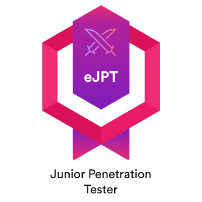
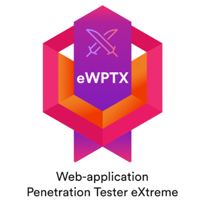

# 🏆 Achievements, Certifications & Skills

A snapshot of my journey in cybersecurity — from certifications to technical skills and community involvement.

---

## 🛡️ Certifications

###  CAPEN — Certified Application Penetration Testing Expert  
Issued by: SecOps Group  
✅ Focus: Web application security, real-world pentesting methodology 

---

###  eJPT — eLearnSecurity Junior Penetration Tester  
Issued by: INE  
✅ Focus: Networking, web app attacks, basic exploitation  
🔗 [View Certificate](https://certs.ine.com/4bb2d27e-6d55-483e-a268-f4b680cfc868#acc.q3UkzPow)

---

###  eWPTX — eLearnSecurity Web App Penetration Tester eXtreme  
Issued by: INE  
✅ Focus: Advanced web app pentesting, bypass techniques, WAF evasion  
🔗 [View Certificate](https://certs.ine.com/8b21947a-faa4-4394-be96-61e30414e423#acc.PzLYaJxV)

---

###  Cyber Security & Forensics Graduate  
Issued by: IBM  
✅ Focus: Cybersecurity fundamentals, digital forensics, and secure system design  
🔗 [View Certificate](https://www.credly.com/badges/06f2d298-2f2b-4b43-92b1-395b61d7034b/linked_in_profile)

---

## 🧠 Skills

### 🔐 **Application & API Security**
- Web & API Penetration Testing
- Access Control Testing (BAC, IDOR, privilege escalation)
- OAuth/OpenID testing
- Business Logic Bugs

### 🧰 **Tools & Techniques**
- Burp Suite, Nmap, FFUF, Postman, Intercepting Proxies
- JWT attacks, Regex fuzzing, SSRF chains
- Recon: Subfinder, Amass, Shodan, gau, httpx, nuclei

### 🌐 **Cloud & DevSecOps**
- Security assessments on AWS, Azure, and GCP (ongoing)
- Familiar with IAM misconfigs, exposed buckets, metadata service abuse

### 🧑‍💻 **Programming & Scripting**
- Languages: Python, Go, JavaScript, Bash
- Custom scripts for automation, recon, and exploitation

### 🔧 **Other Skills**
- Writing professional pentest reports
- Vulnerability triage and PoC creation
- Browser extension reverse engineering
- Secure development best practices

---

## 💻 Community & Contributions

- Active bug bounty hunter on **HackerOne** and **Bugcrowd**  
- Published writeups on **InfoSec Writeups**  
- Sharing insights, bugs, and tips on **LinkedIn** and my [Blog](https://bhaveshraj336.github.io/)

---

## 🎯 Goals Ahead

- OSCP (in progress)  
- Tooling: Automating Broken Access Control detection  
- Expand expertise in Cloud & Kubernetes Security

---

> “Security is not a product, but a process.” – Bruce Schneier

---

*Let’s connect! [Reach out](mailto:bhaveshrajpurohit336@gmail.com) if you'd like to collaborate.*
